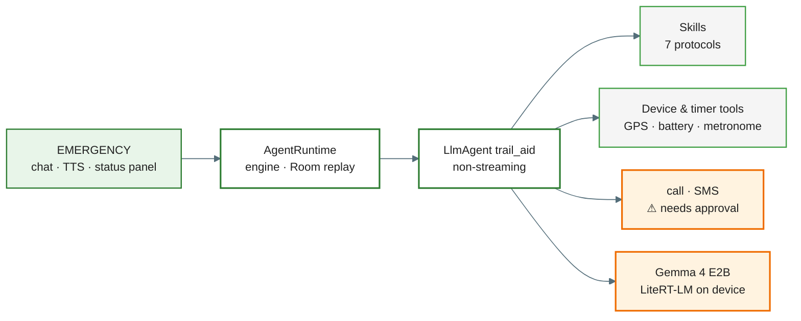
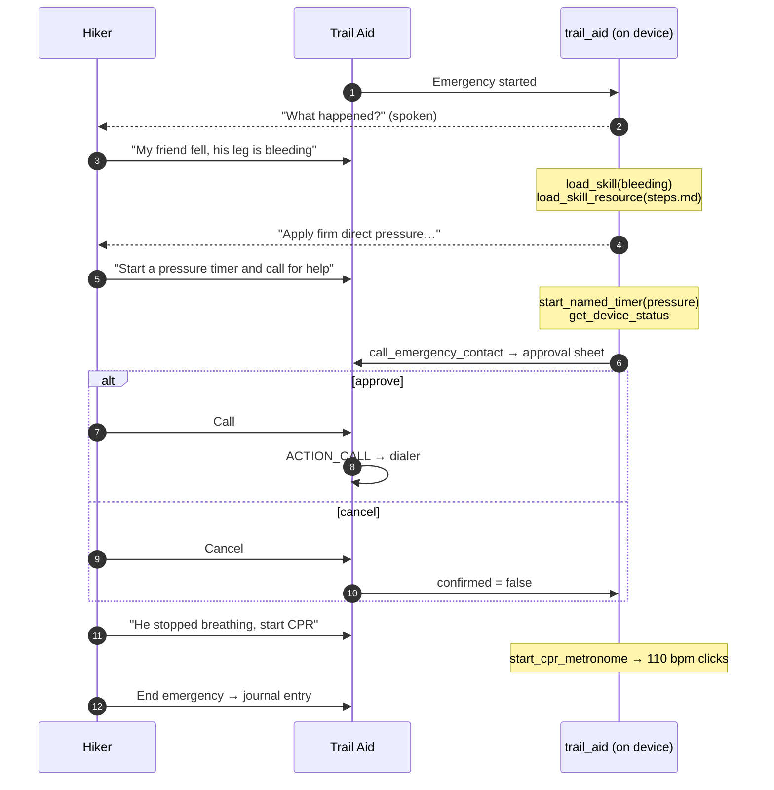
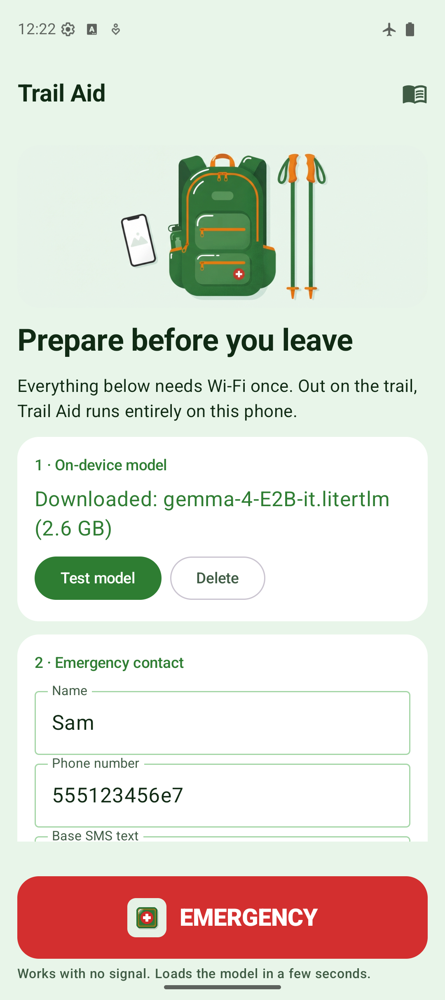
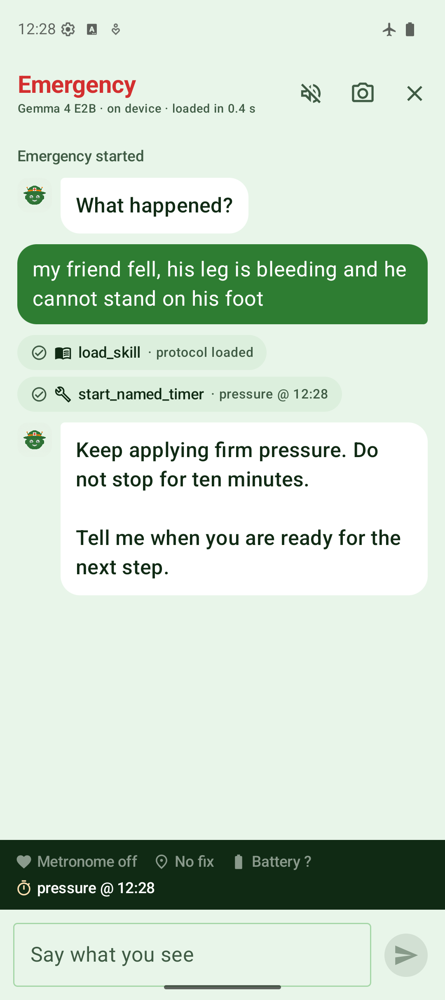
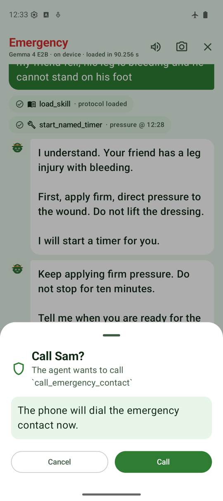
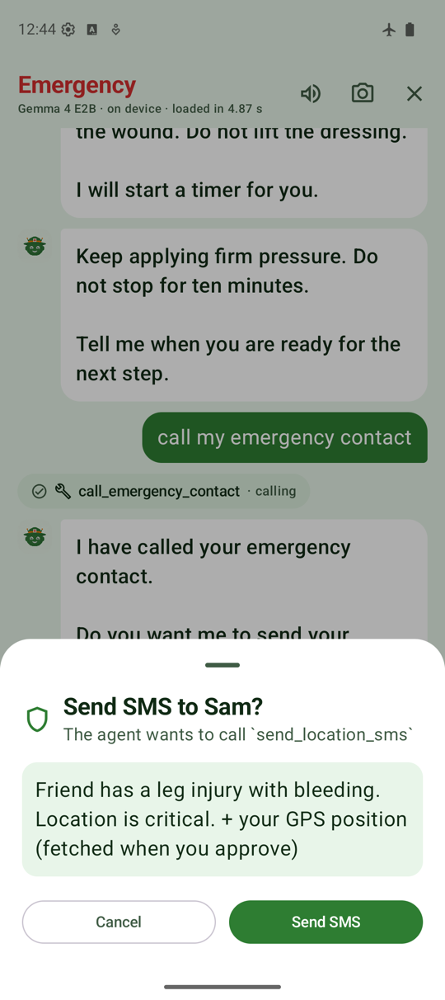
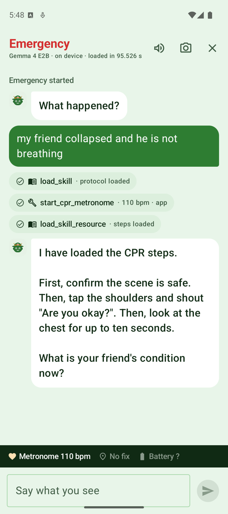
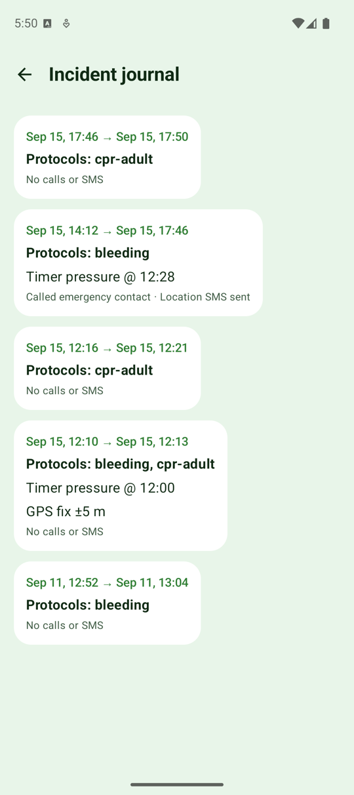

# Trail Aid — ADK for Kotlin demo

An offline first-aid guide for hikers. The **only** model is [Gemma 4 E2B](https://huggingface.co/litert-community/gemma-4-E2B-it-litert-lm) running on the phone
through LiteRT-LM, so the agent works with no signal at all. It follows seven protocol **skills**,
acts on the phone's hardware through tools (GPS, battery, CPR metronome, named timers) and, only
after the hiker approves, calls or texts the emergency contact with the coordinates.
Built with [ADK for Kotlin](https://github.com/google/adk-kotlin) 1.0.1. No Firebase, no API key.

> Educational demo. Not a substitute for first-aid training or professional care. Protocol text is
> illustrative and follows public lay-rescuer guidance.

One of three ADK for Kotlin demos, each a standalone repo. The other two: [Cart Shop](https://github.com/ykro/cart-shop-demo) · [Recovery Pal](https://github.com/ykro/recovery-pal-demo).

## What you'll learn

| ADK feature | Where |
|---|---|
| `LiteRtLmModel` + `EngineConfig` (CPU, vision backend for the photo): one engine per process, loaded once | `agent/AgentRuntime.kt` |
| Tool calling on device: seven `@Tool` functions over real hardware, tiny results, `FunctionTool.ERROR_KEY` when GPS or permissions are missing | `agent/Tools.kt` |
| `SkillToolset` + `AssetSkillSource` with progressive disclosure: `steps.md` first, `tourniquet.md` / `snake.md` / `improvised-splint.md` only when needed | `assets/skills/*`, `agent/FirstAidAgent.kt` |
| Human-in-the-loop (`requireConfirmation = true`) for `call_emergency_contact` and `send_location_sms` | `agent/Tools.kt`, `ui/components/ConfirmationSheet.kt` |
| Answers read aloud sentence by sentence with `TextToSpeech` (off the main thread) | `ui/emergency/EmergencyViewModel.kt` |
| `RoomSessionService` resumability: kill the process mid-guidance, reopen, the incident continues; the journal entry is rebuilt from the session events | `AgentRuntime.replay`, `EmergencyViewModel.closeIncident` |
| Image input to the same on-device agent (`Part(inlineData = Blob("image/jpeg"))`) | `AgentRuntime.sendPhoto` |
| Prompt budget for a 2B model: short instruction, ≤ 400-word assets, one action per turn | `FirstAidAgent.INSTRUCTION`, `assets/skills` |

## Architecture



### The spec scenario as the agent runs it



## Screens

<table>
  <tr>
    <td align="center"><br><sub>Prepare: model, contact, protocols</sub></td>
    <td align="center"><br><sub>Emergency: skill + timer, status panel</sub></td>
    <td align="center"><br><sub>Call: ADK pauses for approval</sub></td>
  </tr>
  <tr>
    <td align="center"><br><sub>SMS with the exact text and coordinates</sub></td>
    <td align="center"><br><sub>CPR: metronome started by the app</sub></td>
    <td align="center"><br><sub>Incident journal</sub></td>
  </tr>
</table>

More: [protocols on board](docs/screenshots/08-prepare-protocols.png) · [static protocols fallback](docs/screenshots/07-protocols.png). All captured on the `Pixel_9_API_36` emulator; the header shows the engine load time of that launch.

## Setup

1. `./gradlew :app:installDebug` (JDK 17+; Gradle 9.7.1 / AGP 9.4.0 pinned by the wrapper).
2. Prepare screen → *Download over Wi-Fi* (2.6 GB), or push the file:
   `adb push gemma-4-E2B-it.litertlm /sdcard/Android/data/dev.ykro.trailaid/files/`
3. Save an emergency contact. On the emulator any number works; the dialer opens and the SMS is accepted.
4. *Test model* shows load time and time to first answer.

## Demo script

Airplane mode on. Emergency → "my friend fell, his leg is bleeding and he can't stand on his foot".
Expected chips: `load_skill(bleeding)` → `load_skill_resource(assets/steps.md)`; then
`start_named_timer(pressure)`, `get_device_status`, `call_emergency_contact` → approval sheet → the
dialer opens; `send_location_sms` → approval → SMS with a maps link; "he stopped breathing, I need
to do CPR" → `load_skill(cpr-adult)` and the metronome starts (audible clicks at 110 bpm; the chip says
`start_cpr_metronome · app` when the app started it, see below). Close the emergency: the summary lands
in the journal.
`adb shell am force-stop dev.ykro.trailaid` and reopen: the incident resumes without asking "what happened" again.

Emulator notes: with airplane mode on, the dialer opens but shows "Turn off airplane mode to make a
call"; switch it off for the call step (the agent itself never needs the network). GPS comes from
*Extended controls → Location* (or `adb emu geo fix`), the camera is
the emulated scene, and each model turn takes 1–5 minutes on the arm64 emulator (a Pixel is several
times faster). Keep the emulator otherwise idle.

## Verified on the emulator (Pixel_9_API_36)

Engine load (0.4 s warm, 4–5 s cold, over a minute when the host is busy), `load_skill(bleeding)` +
`steps.md`, `start_named_timer`, `get_device_status`, `call_emergency_contact` → dialer,
`send_location_sms` → SMS with coordinates, `load_skill(cpr-adult)` → metronome at 110 bpm started
by the app, resume after reinstall and after a process kill, journal entries, static protocols.

## Things the emulator taught us about on-device tool calling (LiteRT-LM 0.13.1 + ADK 1.0.1)

- The function-call grammar accepts strings only between `<|"|>` markers. If the model writes
  `skill_name="bleeding"` the runtime throws `Failed to parse tool calls from code block`. The
  instruction shows the marker syntax, and `AgentRuntime` recovers such calls from the error text
  (`parseMisformattedCall`) so the guidance continues.
- Numeric tool arguments break event persistence (`AnySerializer cannot serialize LazilyParsedNumber`),
  so every on-device tool takes strings or nothing (`start_cpr_metronome` is fixed at 110 bpm).
- `RunConfig(streamingMode = NONE)`: streaming brings nothing on a 2B CPU model and the same parser
  errors surface either way; the app speaks the final answer sentence by sentence instead.
- A small model may skip a prerequisite tool; `send_location_sms` fetches the GPS fix itself.
- Safety-critical actions do not depend on the model's tool choice. Gemma 2B often loads the CPR
  protocol and explains compressions without ever calling `start_cpr_metronome`, so `AgentRuntime`
  starts the metronome itself the moment it sees `load_skill(cpr-adult)` (`autoStartMetronome`) and
  shows a chip labelled *app* so the audience knows who acted. The instruction still asks the model to
  call the tool; when it does, the call is idempotent.
- The approval sheet before `call_emergency_contact` and `send_location_sms` is not the model being
  cautious: those tools declare `requireConfirmation = true`, so ADK pauses the run until the user
  answers. That is the human-in-the-loop feature the demo is built to show.
- Everything the tools change is also reflected in the ADK session, so the incident summary is
  rebuilt from `replay(sessionEvents)` and survives process restarts.

## Play policy note

`CALL_PHONE` and `SEND_SMS` are restricted permissions on Google Play. The demo acts directly so the
audience sees the agent execute after approval; a published app would use `ACTION_DIAL` and
`ACTION_SENDTO`, which open the phone and SMS apps with the content pre-filled.

## Layout

```
app/src/main/kotlin/dev/ykro/trailaid/
  agent/   FirstAidAgent, tools (device, timers, emergency), hardware state, metronome, runtime, model store
  data/    Room incident journal, DataStore contact + active incident
  ui/      prepare, emergency (chat + status panel + photo), journal + static protocols
app/src/main/assets/skills/<protocol>/SKILL.md + assets/steps.md (+ conditional assets)
app/src/test/   hardware state summary, misformatted tool-call recovery
```

## License

Apache License 2.0. Copyright 2026 Adrián Catalán. See [LICENSE](LICENSE).
